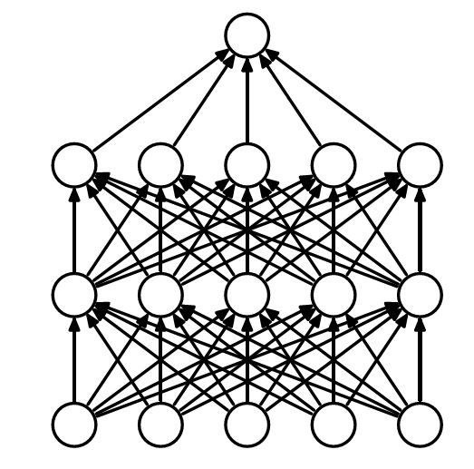

# paper summary 
In recent years, artificial neural networks have shown excellent performance in pattern recognition and regression. (Deep learning in neural networks: An overview
) The convolutional neural network got unbelievable scores in image classification. So what is neural newtwork? Why doee it perform so good?

Let's begin by first understanding what consist of neural network. Neuron and activation function are the two main part in Neural network. In fact, A neuron is just a function, receiving several inputs and giving the result. Typically, those inputs are summed with weights, and this sum is passed through a nonlinear function, often called activation function, such as the sigmoid, relu, and so on. Above is a neuron model, and aritifical neural network consists of numbers of neurons. Different architecture of neurons have different performance. The fully connected network is the classic architecture, shown below.

Neurons are placed in some layers, and each neuron in above layer is connected to all the neurons in below layer. The model is the basic architecture, having nice performace in some nonlinear problem. Other architectures is based on the fully connected neural network, and some architectures are significantlly effective in special domain, such as Convolution neuron network processing image, and Long short-term memory processing sequances of data. We are devoted to find more effective architectures to sovle different problems. Our goal is to find a architecture having excellent in different realms.

Now we know tha neural network is the combination of linear functions and nonlinear functions. So the challenge is how to determine the weights in the linear functions. We can denote neural network as y = NN(x). x is the inputs, and y is the outputs of the neural networks. In order to evaluate the NN function, we can define the loss(x,w) function according to different problem. So the challenge become a optimal problem to minimize the loss function. Intuitively we want to get the gradient of w. And the back propagation algorithm, a main algorithm in neural network, can get all parameters' gradient in a short time. 

Batch gradient descent, stochastic graident descent and mini-batch gradient descent are three different variants of gradient descent, which differ in how much data is used to computer the gradient of the loss function. Depending on the amount of data, the accuracy and the training time will have an update. Batch gradient descent computes the gradient to update the parameters once using the entire data. Batch gradient can be very slow, as we need to load the whole data in memory and compute the gradient for one update. In contrast, stochastic gradient descent execute a paramter update for each training data. stochastic gradient descent performs much faster than batch gradient descent. But one training data might contain too much noise leading to bad result. The mini-batch gradient descent perform well in both time and effect. The mini-batch gradient descent perform a parameter update for every mini-batch of n training sample, So mini-batch gradient descent overcome the challenge of time and effect.