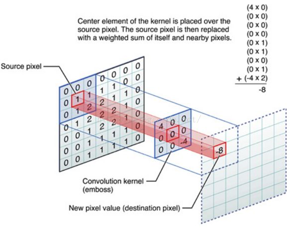

# paper summary 
In recent years, artificial neural networks have shown excellent performance in pattern recognition and regression. (Deep learning in neural networks: An overview
) The convolutional neural network got unbelievable scores in image classification. So what is neural newtwork? Why doee it perform so good?

Let's begin by first understanding what consist of neural network. Neuron and activation function are the two main part in Neural network. In fact, A neuron is just a function, receiving several inputs and giving the result. Typically, those inputs are summed with weights, and this sum is passed through a nonlinear function, often called activation function, such as the sigmoid, relu, and so on. Above is a neuron model, and aritifical neural network consists of numbers of neurons. Different architecture of neurons have different performance. The fully connected network is the classic architecture, shown below.

Neurons are placed in some layers, and each neuron in above layer is connected to all the neurons in below layer. The model is the basic architecture, having nice performace in some nonlinear problem. Other architectures is based on the fully connected neural network, and some architectures are significantlly effective in special domain, such as Convolution neuron network processing image, and Long short-term memory processing sequances of data. We are devoted to find more effective architectures to sovle different problems. Our goal is to find a architecture having excellent in different realms.

Now we know tha neural network is the combination of linear functions and nonlinear functions. So the challenge is how to determine the weights in the linear functions. We can denote neural network as y = NN(x). x is the inputs, and y is the outputs of the neural networks. In order to evaluate the NN function, we can define the loss(x,w) function according to different problem. So the challenge become a optimal problem to minimize the loss function. Intuitively we want to get the gradient of w. And the back propagation algorithm, a main algorithm in neural network, can get all parameters' gradient in a short time. 

Batch gradient descent, stochastic graident descent and mini-batch gradient descent are three different variants of gradient descent, which differ in how much data is used to computer the gradient of the loss function. Depending on the amount of data, the accuracy and the training time will have an update. Batch gradient descent computes the gradient to update the parameters once using the entire data. Batch gradient can be very slow, as we need to load the whole data in memory and compute the gradient for one update. In contrast, stochastic gradient descent execute a paramter update for each training data. stochastic gradient descent performs much faster than batch gradient descent. But one training data might contain too much noise leading to bad result. The mini-batch gradient descent perform well in both time and effect. The mini-batch gradient descent perform a parameter update for every mini-batch of n training samples, So mini-batch gradient descent overcome the problems of time and effect.

But a another challenge is to minimize the non-convex error function with high demension. Gradient descent will be trapped in the local minmum to have a bad performance. In order to  overcome this, some variants can be applied to solve the question. Momentum can help accelerate stochastic graident descent in the relevant direction, and it does this by adding a fration r of the update vector of the past time step to the current update vector.

Nesterov accelerated gradient is a way to give the next position and recompute the present gradient using the next position to update the parameters.

Those above method all have a drawback that all parameters update themselves in a same learning rate. Adagrad is a method to adapt the learning rate to different paramters, having a great progress. Briefly Adagrad modifies the gerenal learning rate for each parameter based on the past gradient.

Adadelta is an extension of Adagrad that seek to solve the monotonically decreasing learning rate. Instead of accumulating all past squared gradient, Adadelta uses an exponentially decaying average to prevent the diminishing learning rates.

Adam method is variant to sovle the diminshing learning rate in Adagrad. Adam as well store an exponentially decaying average of past squared gradients and gradient to adjust the learning rate. 

In order to get the bias-corrected first and second moment estimates:

Then we use those moments to update the parameters just as we have seen in Adadelta.

Nadam method is the combination of Adam and Nesterov accelerated gradient.

Following is the visualization of those algorithms.

So, which optimizer should we use? If the input data is sparse, adaptive learning-rate methods are most likely to achieve the best results.

During optimization, vanishing gradient is a hard problem in deep neural network. Based on back propogation and gradient, the neural network receive an update proportional to the partial derivative of the error function with respect to the current weight in each iteration of training. For example, traditional activation functions, such as tangent function, have gradients in range (0,1), and backpropagation compute gradient by the chain rule. This has the effect of multiplying n of these small numbers to compute gradients of the "front" layers in an n-layer network, meaning that the gradient (error signal) decreases exponentially with n while the front layers train very slowly. One solution to vanishing gradient is batch normalization. Batch normalization is to normalize the output of a layer, then the output of the batch normalization is the input of the next layer. After batch normalization, the gradient will be amplified during the backpropogation, which helps to sovle vanishing gradient. Except the effort of reducing vanishing gradient, batch normalization also perform well in reducing overfitting.

Another problem in optimization is overfitting, which means that the model performs very well in training samples, but it has a bad accuracy in the test samples. many of the complicated relastionships in the train samples will be the result of sampling noise. There are many mehtods to reducing it. Those include stopping training as soon as performance start to get worse, introducing weight penalties of various kinds such as L1 and L2 regularization, batch normalization and drop out. Before drop out, model combination should be introduced. Model combination nearly always improves the performance of machine learning. Model combination is to average different models' outputs. But differnet model need either different architectures or different training samples. Training different architectures models is hard because the optimization of the model is a hard task and training different models need large computation. Moreover, large network require large amount of training data.With the limitation of computation and data, we can't train different models to combine different models. Dropout is a technique that sovle both these issues. It prevents overfitting and provides a way of approximately combining many differen neural network. The term "dropout" refers to dropping out units in a neural network. By dropping a unit out, we mean temporarily removing it from the network, along with all its incoming and outgoing connections. The choice of which units to dropout is random. Each unit is retain with a fixed probability. Applying dropout to a network amounts to train some "thin" network. If a unit is retain with probability p during training, the outputing weights of the unit are multiplied by p at test time. Following describe the performance.

So dropout use a pretty technical way to address the limitation of computation and data. In training progress, dropout allow us to train some small network without large amount of computation and data. In test progress, multiplying weights with the retain probability reach the good performance of averaging prediction of different neural network.

Different architectures can deal with different problem, sometimes a fine architecture may not need much time to update the parameters but  the model can alse perform well. Convolutional neural network is a good example to illstrate it. Convolutional neural network has two parts, convolution part and pooling part. In the convolution part, convolutional neural network apply a specialized linear operation to the input tensor. Convolution part firstly define a filter which is a tensor with shape  (number of output feature map) x (feature map width) x (feature map height) x (feature map channels), then filter convolutes the input feature maps to generate the output feature maps of the convolutional layer. The convlution operation is illustrated by following pic.

The second part of convolutional neural network is pooling part, which is a form of non-linear down-sampling. There are several non-linear functions to implement pooling among which max pooling is the most common. Pooling layer take the input feature map into several small rectangles, and for each rectangles, the pooling layer outputs the maxmum in the rectangle region.

There are many advantages to use convolution operation. All the output neurons in the same feature map share the same filter, in other words convolution operation can decrease the parameters in the neural network. Different filters can detect different features in the picture which releases the burden of each neuron. In convolutional neural network, each neuron just need to detect one pattern, which improve the whole network's performance.

Why is convolutional neural network useful? Let's consider fully connected neural network first. In fully connected neural network, each neuron is connected with all the neurons in the previous layer. But sometimes the fully connected architecture introduce much unneccessay information to the neuron that the neuron can't extract the useful information. In convlution neural network, each neuron is connected to several neurons constrained by the filters, which can detect a special feature in a area. In other word, convolutional neural network is a simple version of fully connected neural network. Each neuron is just connected to some special neurons. Since the succes of convolutional neural network, the thought that good designed architecture can actually improve the performace of neural network is accepted. And some other is appear to sovle different problems.

Convolutional neural networks perform well in visual image, however there are many drawbacks in convolutional neural network. Convolutional neural network method only cares about the existence of the object in the picture around a specific location; but it is insensitive to the spatial relations and direction of the object. So convolutional neural network can detect a person from a picture but convolutional neural network can not know whether the persons are the same one in different pictures. From this idea, capsule neural networks can get more information about the object since capsules. Capsules are a vector and the norm of the output capsule refer to the likelihood of the classification. Each dimension of capsules refer to different features of the object. Capsule neural networks use dynamic routing to optimize the parameters between the capsules. Dynamic routing uses the inner production between the capsules to update the parameters and then non-linear squashing function rescale the norm of the capsule. Detailly capsule neural networks use squashing function to ensure that short vectors are transfered to almost zero length and long vectors are transfered to almost length of 1. Below is the squashing function.

where vj is the vector output of capsule j and sj is the input of the capsule.

For all but the first layer of capsules, the input to a capsule sj is a weighted sum over all output of the capsules in the layer below. 

where ui is the output vetcor below the j layer, and tht cij are coupling coefficients determined by the dynamic routing.

The coupling coefficients between capsule i and all the capsules in the layer above sum to 1. Capsule neural networks complement it by softmax function. 

where bij is the log prior probabilities that capsule i should be coupled to capsule j. Then the initial coupling coefficients are then iteratively refined by measuring the agreement between the current output vj of each capsule, j, in the layer above and the prediction uj|i made by capsule i. Routing algorithm is below.

